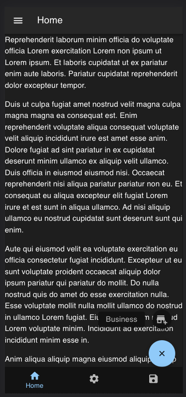

# Schmuck Miser

Tool to track my finances and sometimes foolish decisions.

# What is it again?

For almost a year, I've been tracking my finances in a google spreadsheet. This spreadsheet has grown as I've added more things to track. Student loans, mortgage payments, utility bills, cryptocurrency mining, stocks held in the market and benchmarking for performance, dividend payout calendar, budgeting for a full year, pay stub logs, total lifetime earnings taxed via social security/medicare, credit scores, credit report details, daily notes, and the list goes on.

Once I started tracking things daily, my financial life has taken a turn for the better, and more opportunities became apparent.

I've come to the realization that a lot of this needs to be done in a website to reduce the amount of effort I'm putting in each day to manage the spreadsheet.

# Why?

I used to have a financial advisor and was preparing a few things for our annual review. Essentially I try to have as much information as possible so that I am ready for anything asked for. After our meeting, I realized the report I had made was far more useful to me than what he was offering.

As I started using the spreadsheet more often, I could see the "big picture". A budget let me see the total effect of spending on an annual basis and revealed goals of what I could eliminate. Services were cut, reduced, or switched providers. Benchmarking my holdings in the stock market against an index helped give me confidence that I was doing well. Unfortunately, it also revealed a great amount of opportunity loss with the accounts under management with my financial advisor.

As I've continued throughout the year, I've continued to locate more data and evaluate how I can improve my financial health with great success.

# Stack

So for now, I'm experimenting with material-ui on this project. I'm also focusing on making this usable on my phone, so the interface isn't going to look great on desktop browsers at first.
